## Cel projektu

Projekt polega na prostym opracowaniu statystycznym wyników porównania
działania wybranych algorytmów minimalizacji stochastycznej.
Zdecydowaliśmy się do porównania użyć następujących algorytmów:

#### - Poszukiwanie przypadkowe (Pure Random Search, PRS)

#### - Metoda wielokrotnego startu (multi-start, MS)

## Opis algorytmów

### Poszukiwanie przypadkowe (Pure Random Search, PRS)

PRS polega na losowym przeszukiwaniu przestrzeni rozwiązań, w której
minimalizowana funkcja jest zdefiniowana. Działa w następujący sposób:

1.  **Losowanie punktów**: Losujemy kolejne punkty w przestrzeni
    poszukiwań z rozkładu jednostajnego. Jeżeli dziedzina poszukiwań
    jest kostką wielowymiarową, to każdą współrzędną punktu losujemy z
    odpowiedniego jednowymiarowego rozkładu jednostajnego.  
    Na przykład, jeśli dziedzina poszukiwań to kostka trójwymiarowa
    \[0, 1\] × \[−2, 2\] × \[100, 1000\], losowanie współrzędnych
    wygląda następująco:

    -   pierwsza współrzędna: *U*(0, 1),
    -   druga współrzędna: *U*(−2, 2),
    -   trzecia współrzędna: *U*(100, 1000).

2.  **Porównanie wartości funkcji**: Wartość funkcji w każdym
    wylosowanym punkcie porównujemy z aktualnie zapamiętanym minimum.
    Jeśli wartość funkcji w nowym punkcie jest mniejsza, zapamiętujemy
    ten punkt jako nowe minimum.

3.  **Wynik**: Wartość funkcji w ostatnim zapamiętanym punkcie stanowi
    wynik algorytmu.

------------------------------------------------------------------------

### Metoda wielokrotnego startu (Multi-Start, MS)

Algorytm łączy losowe przeszukiwanie przestrzeni z metodami
optymalizacji lokalnej. Jego kroki są następujące:

1.  **Losowanie punktów**: Podobnie jak w , losujemy zadany zbiór
    punktów startowych z rozkładu jednostajnego w przestrzeni
    poszukiwań.

2.  **Uruchomienie optymalizacji lokalnej**: Dla każdego wylosowanego
    punktu startowego uruchamiana jest metoda optymalizacji lokalnej .

3.  **Porównanie wyników**: Dla każdego startu zapisujemy wartość
    funkcji w zwróconym punkcie lokalnego minimum. Wynikiem algorytmu
    jest minimalna wartość funkcji spośród wszystkich punktów końcowych.

------------------------------------------------------------------------

Do porównania należało wybrać dwie z funkcji dostępnych w pakiecie
`smoof`, które są skalarne (single-objective) i mają wersje dla różnej
liczby wymiarów (akceptują parametr `dimensions`).

W celu sprawdzenia dostępnych algorytmów wykonaliśmy następujący
algorytm, który znajdywał dostępne funckje o wymaganych parametrach:

    library(smoof)

    scalar_dimensional_functions <- Filter(function(fn_name) {
      fn <- get(fn_name, envir = asNamespace('smoof'))
      is.function(fn) &&
      'dimensions' %in% names(formals(fn)) &&
      inherits(try(fn(2), silent = TRUE), 'smoof_function') &&
      getNumberOfObjectives(fn(2)) == 1
    }, ls('package:smoof'))

    print(scalar_dimensional_functions)

### Do porównania wybraliśmy dwie funckje:

-   Griewank
-   Schwefel

Nasz wybór padł dokładnie na te funkcję ze względu na nich odmienność,
trudność w optymalizacji oraz niebanalną impelmentację.

### Funkcja Griewanka

ma wiele szeroko rozpowszechnionych minimów lokalnych, które są
regularnie dystrybuowane. Wzór funkcji:

$$f(\mathbf{x}) = \sum\_{i=1}^{d} \frac{x\_i^2}{4000} - \prod\_{i=1}^{d} \cos \left( \frac{x\_i}{\sqrt{i}} \right) + 1$$

gdzie przez *d* rozumiemy ilość wymiarów. Funkcja jest zazwyczaj
definiowa na hiperszceścianach *x**i* ∈ \[−600, 600\], dla
każdego *i* = 1, …, *d*.

Minimum globalne
*f*(**x****\***) = 0,   dla **x****\*** = (0, …, 0)

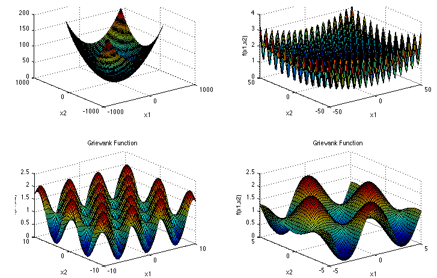

### Funkcja Schwefela

jest złożoną funkcją, posiadającą wiele minimów lokalnych. Wzór funkcji:

$$f(\mathbf{x}) = \sum\_{i=1}^{n} -x\_i \sin \left( \sqrt{|x\_i|} \right)$$

gdzie przez *d* rozumiemy ilość wymiarów. Funkcja jest zazwyczaj
definiowa na hiperszceścianach *x**i* ∈ \[−500, 500\], dla
każdego *i* = 1, …, *d*.

Minimum globalne
*f*(**x****\***) = 418.9829 \* *d*,  dla **x****\*** = (420.9687, …, 420.9687)

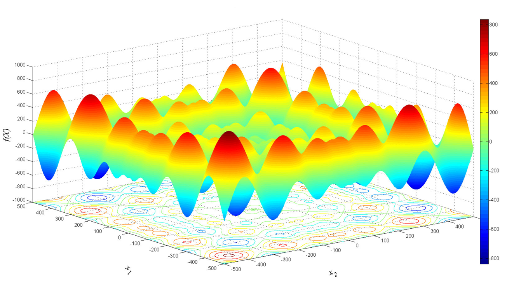

## Specyfikacja sprzętu

#### Obliczenia i testy zostały wykonane na komputerze o następujące specyfikacji:

-   system Windows 10
-   procesor Intel Core i7-6700HQ 2.60 GHz.
-   pamięć Ram 16Gb

# WYNIKI

## Funkcja Griewanka 2D

<table>
<colgroup>
<col style="width: 30%" />
<col style="width: 34%" />
<col style="width: 34%" />
</colgroup>
<thead>
<tr class="header">
<th><strong>Miara</strong></th>
<th><strong></strong></th>
<th><strong></strong></th>
</tr>
</thead>
<tbody>
<tr class="odd">
<td>Średnia</td>
<td>0.6055442</td>
<td>0.6434122</td>
</tr>
<tr class="even">
<td>Wartość najmniejsza</td>
<td>0.007396</td>
<td>0.0373963</td>
</tr>
<tr class="odd">
<td>Wartość największa</td>
<td>4.4481658</td>
<td>1.7034647</td>
</tr>
<tr class="even">
<td>Mediana</td>
<td>0.3253765</td>
<td>0.6161477</td>
</tr>
<tr class="odd">
<td>Dolny kwartyl (25%)</td>
<td>0.1257573</td>
<td>0.4292943</td>
</tr>
<tr class="even">
<td>Górny kwartyl (75%)</td>
<td>0.8310025</td>
<td>0.8541051</td>
</tr>
</tbody>
</table>

## Funkcja Griewanka 10D

<table>
<colgroup>
<col style="width: 30%" />
<col style="width: 34%" />
<col style="width: 34%" />
</colgroup>
<thead>
<tr class="header">
<th><strong>Miara</strong></th>
<th><strong></strong></th>
<th><strong></strong></th>
</tr>
</thead>
<tbody>
<tr class="odd">
<td>Średnia</td>
<td>5.3433198^{-11}</td>
<td>51.7091663</td>
</tr>
<tr class="even">
<td>Wartość najmniejsza</td>
<td>1.3820056^{-12}</td>
<td>12.0229676</td>
</tr>
<tr class="odd">
<td>Wartość największa</td>
<td>2.1964297^{-10}</td>
<td>83.9943267</td>
</tr>
<tr class="even">
<td>Mediana</td>
<td>4.1341264^{-11}</td>
<td>51.6668436</td>
</tr>
<tr class="odd">
<td>Dolny kwartyl (25%)</td>
<td>2.7560176^{-11}</td>
<td>43.7718444</td>
</tr>
<tr class="even">
<td>Górny kwartyl (75%)</td>
<td>7.4529827^{-11}</td>
<td>61.4505366</td>
</tr>
</tbody>
</table>

## Funkcja Griewanka 20D

<table>
<colgroup>
<col style="width: 30%" />
<col style="width: 34%" />
<col style="width: 34%" />
</colgroup>
<thead>
<tr class="header">
<th><strong>Miara</strong></th>
<th><strong></strong></th>
<th><strong></strong></th>
</tr>
</thead>
<tbody>
<tr class="odd">
<td>Średnia</td>
<td>8.1357054^{-11}</td>
<td>222.7744787</td>
</tr>
<tr class="even">
<td>Wartość najmniejsza</td>
<td>1.3866686^{-13}</td>
<td>138.0348086</td>
</tr>
<tr class="odd">
<td>Wartość największa</td>
<td>1.7841773^{-10}</td>
<td>271.2005696</td>
</tr>
<tr class="even">
<td>Mediana</td>
<td>7.5553341^{-11}</td>
<td>223.940142</td>
</tr>
<tr class="odd">
<td>Dolny kwartyl (25%)</td>
<td>5.6181226^{-11}</td>
<td>207.9649149</td>
</tr>
<tr class="even">
<td>Górny kwartyl (75%)</td>
<td>1.0998349^{-10}</td>
<td>239.8048899</td>
</tr>
</tbody>
</table>

## Funkcja Schwefela 2D

<table>
<colgroup>
<col style="width: 30%" />
<col style="width: 34%" />
<col style="width: 34%" />
</colgroup>
<thead>
<tr class="header">
<th><strong>Miara</strong></th>
<th><strong></strong></th>
<th><strong></strong></th>
</tr>
</thead>
<tbody>
<tr class="odd">
<td>Średnia</td>
<td>-836.7813912</td>
<td>-797.1918759</td>
</tr>
<tr class="even">
<td>Wartość najmniejsza</td>
<td>-837.9657745</td>
<td>-836.5685042</td>
</tr>
<tr class="odd">
<td>Wartość największa</td>
<td>-719.5274399</td>
<td>-643.5621982</td>
</tr>
<tr class="even">
<td>Mediana</td>
<td>-837.9657745</td>
<td>-804.2280449</td>
</tr>
<tr class="odd">
<td>Dolny kwartyl (25%)</td>
<td>-837.9657745</td>
<td>-823.5638115</td>
</tr>
<tr class="even">
<td>Górny kwartyl (75%)</td>
<td>-837.9657745</td>
<td>-781.6197479</td>
</tr>
</tbody>
</table>

## Funkcja Schwefela 10D

<table>
<colgroup>
<col style="width: 30%" />
<col style="width: 34%" />
<col style="width: 34%" />
</colgroup>
<thead>
<tr class="header">
<th><strong>Miara</strong></th>
<th><strong></strong></th>
<th><strong></strong></th>
</tr>
</thead>
<tbody>
<tr class="odd">
<td>Średnia</td>
<td>-3262.1275223</td>
<td>-1990.2290063</td>
</tr>
<tr class="even">
<td>Wartość najmniejsza</td>
<td>-3716.0755343</td>
<td>-2648.5365291</td>
</tr>
<tr class="odd">
<td>Wartość największa</td>
<td>-2923.4470726</td>
<td>-1671.7495182</td>
</tr>
<tr class="even">
<td>Mediana</td>
<td>-3259.0250766</td>
<td>-1977.0998535</td>
</tr>
<tr class="odd">
<td>Dolny kwartyl (25%)</td>
<td>-3378.9804707</td>
<td>-2101.5557137</td>
</tr>
<tr class="even">
<td>Górny kwartyl (75%)</td>
<td>-3142.8476519</td>
<td>-1880.3428427</td>
</tr>
</tbody>
</table>

## Funkcja Schwefela 20D

<table>
<colgroup>
<col style="width: 30%" />
<col style="width: 34%" />
<col style="width: 34%" />
</colgroup>
<thead>
<tr class="header">
<th><strong>Miara</strong></th>
<th><strong></strong></th>
<th><strong></strong></th>
</tr>
</thead>
<tbody>
<tr class="odd">
<td>Średnia</td>
<td>-5930.2842622</td>
<td>-2871.2092706</td>
</tr>
<tr class="even">
<td>Wartość najmniejsza</td>
<td>-6721.5020158</td>
<td>-3883.630182</td>
</tr>
<tr class="odd">
<td>Wartość największa</td>
<td>-5415.4216596</td>
<td>-2404.6476755</td>
</tr>
<tr class="even">
<td>Mediana</td>
<td>-5927.3537852</td>
<td>-2845.6522752</td>
</tr>
<tr class="odd">
<td>Dolny kwartyl (25%)</td>
<td>-6073.1127276</td>
<td>-3018.7275952</td>
</tr>
<tr class="even">
<td>Górny kwartyl (75%)</td>
<td>-5732.1016643</td>
<td>-2683.1582378</td>
</tr>
</tbody>
</table>

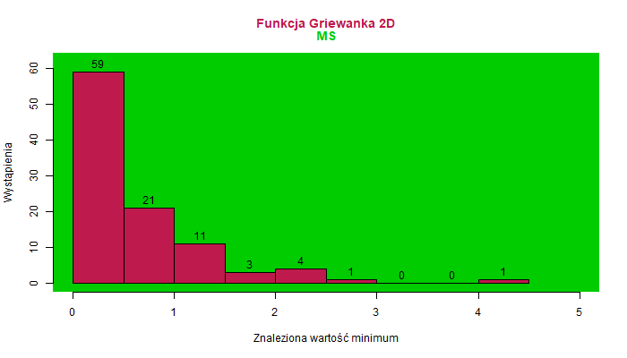

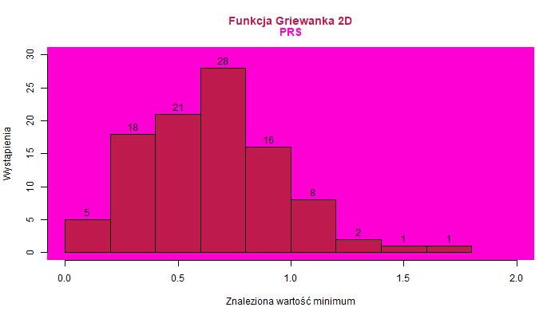

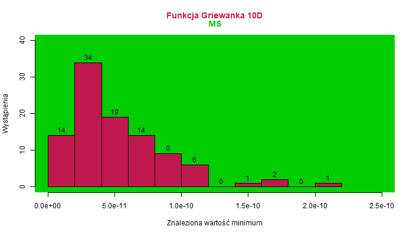

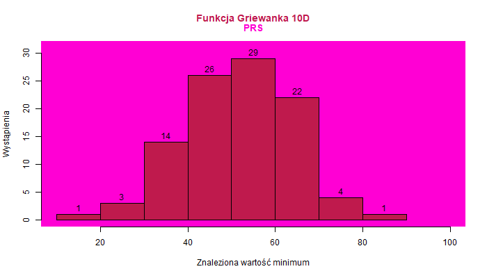

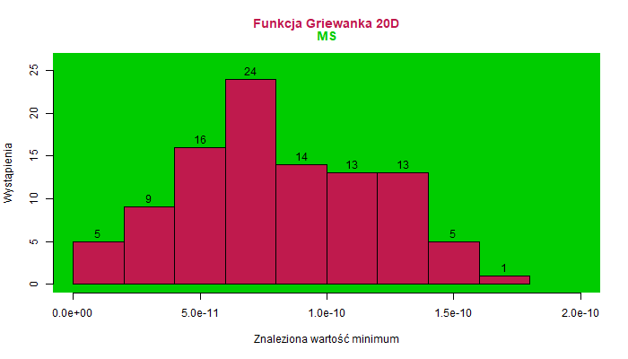

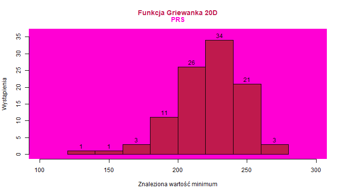

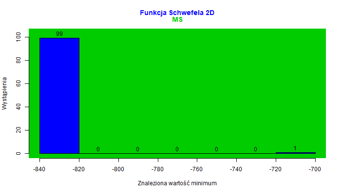

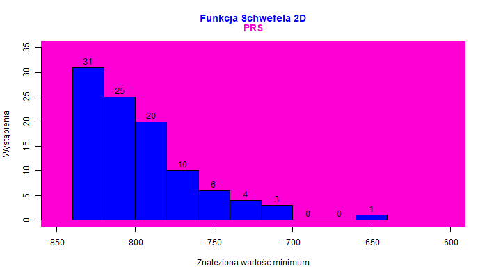

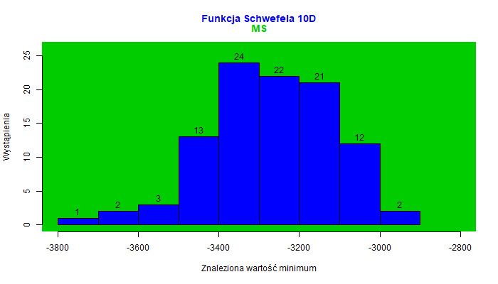

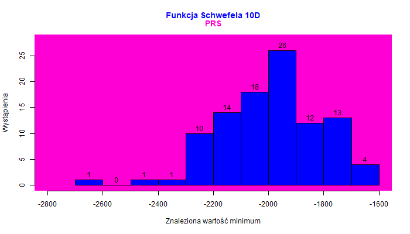

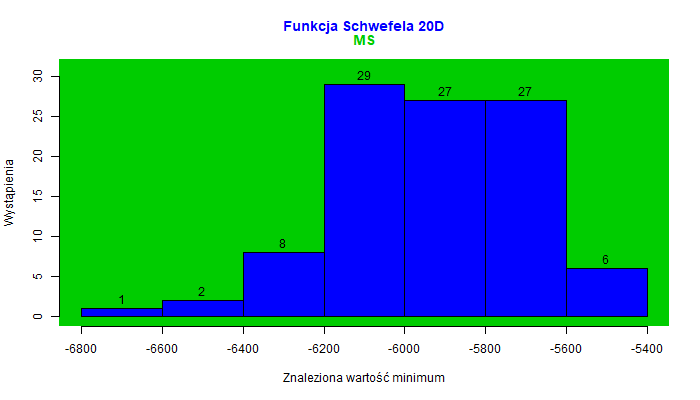

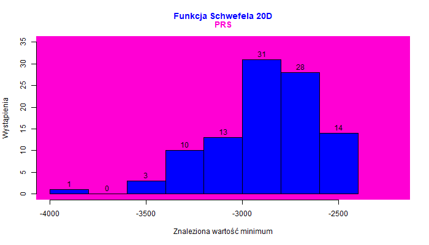

## T testy

Dla hipotezy zerowej twierdzącej, że średnie są sobie równe

#### Funkcja Griewanka, 2D

    ## 
    ##  Paired t-test
    ## 
    ## data:  G2PRS and G2MS
    ## t = 0.51955, df = 99, p-value = 0.6045
    ## alternative hypothesis: true mean difference is not equal to 0
    ## 95 percent confidence interval:
    ##  -0.1067528  0.1824889
    ## sample estimates:
    ## mean difference 
    ##      0.03786802

#### Funkcja Griewanka, 10D

    ## 
    ##  Paired t-test
    ## 
    ## data:  G10PRS and G10MS
    ## t = 40.75, df = 99, p-value < 2.2e-16
    ## alternative hypothesis: true mean difference is not equal to 0
    ## 95 percent confidence interval:
    ##  49.19135 54.22699
    ## sample estimates:
    ## mean difference 
    ##        51.70917

#### Funkcja Griewanka, 20D

    ## 
    ##  Paired t-test
    ## 
    ## data:  G20PRS and G20MS
    ## t = 87.939, df = 99, p-value < 2.2e-16
    ## alternative hypothesis: true mean difference is not equal to 0
    ## 95 percent confidence interval:
    ##  217.7479 227.8011
    ## sample estimates:
    ## mean difference 
    ##        222.7745

#### Funkcja Schwefela, 2D

    ## 
    ##  Paired t-test
    ## 
    ## data:  S2PRS and S2MS
    ## t = 10.624, df = 99, p-value < 2.2e-16
    ## alternative hypothesis: true mean difference is not equal to 0
    ## 95 percent confidence interval:
    ##  32.19550 46.98353
    ## sample estimates:
    ## mean difference 
    ##        39.58952

#### Funkcja Schwefela, 10D

    ## 
    ##  Paired t-test
    ## 
    ## data:  S10PRS and S10MS
    ## t = 56.898, df = 99, p-value < 2.2e-16
    ## alternative hypothesis: true mean difference is not equal to 0
    ## 95 percent confidence interval:
    ##  1227.543 1316.254
    ## sample estimates:
    ## mean difference 
    ##        1271.899

#### Funkcja Schwefela, 20D

    ## 
    ##  Paired t-test
    ## 
    ## data:  S20PRS and S20MS
    ## t = 91.343, df = 99, p-value < 2.2e-16
    ## alternative hypothesis: true mean difference is not equal to 0
    ## 95 percent confidence interval:
    ##  2992.623 3125.527
    ## sample estimates:
    ## mean difference 
    ##        3059.075

## Wnioski podsumowujące:

Funkcja Schwefela wykazuje większe różnice między algorytmami niż funkcja Griewanka. Dla funkcji Griewanka w 2D nie
zaobserwowano istotnej różnicy między algorytmami, ale dla wyższych
wymiarów (10D, 20D) MS osiąga znacząco lepsze wyniki niż PRS . W przypadku funkcji Schwefela,
która charakteryzuje się trudnymi krajobrazami z wieloma lokalnymi
minimami, metoda MS znacznie lepiej radzi sobie z eksplorowaniem
przestrzeni poszukiwań i znajdowaniem głębszych minimów. Z kolei PRS
wykazuje pewne trudności w bardziej złożonych przestrzeniach, co
prowadzi do większych różnic w wynikach w wymiarach wyższych niż 2D.

W funkcji Schwefela dla 10D i 20D różnice między algorytmami stają się wyraźniejsze,
ponieważ w tych wymiarach przestrzeń staje się bardziej złożona. Różnice
w wynikach są statystycznie istotne, co wskazuje na większą efektywność
w radzeniu sobie z trudnymi funkcjami optymalizacyjnymi w wyższych
wymiarach. Wraz ze wzrostem liczby wymiarów, różnica między algorytmami
staje się coraz bardziej wyraźna. Przewaga MS nad PRS rośnie wykładniczo wraz z
wymiarowością. Testy statystyczne (t-test) oraz średnie różnice
wskazują, że algorytmy różnią się w sposobie rozwiązywania problemu.

Lepsza wersja sprawozdania dostępna jako sprawozdanie.pdf lub sprawozdanie.rmd w repozytorium
