```{r setup, include=FALSE}
knitr::opts_knit$set(output = "README.md")
```

## Cel projektu

Projekt polega na prostym opracowaniu statystycznym wyników porównania działania wybranych algorytmów minimalizacji stochastycznej. Zdecydowaliśmy się do porównania użyć następujących algorytmów:

#### - Poszukiwanie przypadkowe (Pure Random Search, PRS)

#### - Metoda wielokrotnego startu (multi-start, MS)

## Opis algorytmów

### Poszukiwanie przypadkowe (Pure Random Search, PRS)

 polega na losowym przeszukiwaniu przestrzeni rozwiązań, w której minimalizowana funkcja jest zdefiniowana. Działa w następujący sposób:

1.  **Losowanie punktów**: Losujemy kolejne punkty w przestrzeni poszukiwań z rozkładu jednostajnego. Jeżeli dziedzina poszukiwań jest kostką wielowymiarową, to każdą współrzędną punktu losujemy z odpowiedniego jednowymiarowego rozkładu jednostajnego.\
    Na przykład, jeśli dziedzina poszukiwań to kostka trójwymiarowa $[0,1] \times [-2,2] \times [100,1000]$, losowanie współrzędnych wygląda następująco:

    -   pierwsza współrzędna: $U(0,1)$,
    -   druga współrzędna: $U(-2,2)$,
    -   trzecia współrzędna: $U(100,1000)$.

2.  **Porównanie wartości funkcji**: Wartość funkcji w każdym wylosowanym punkcie porównujemy z aktualnie zapamiętanym minimum. Jeśli wartość funkcji w nowym punkcie jest mniejsza, zapamiętujemy ten punkt jako nowe minimum.

3.  **Wynik**: Wartość funkcji w ostatnim zapamiętanym punkcie stanowi wynik algorytmu.

------------------------------------------------------------------------

### Metoda wielokrotnego startu (Multi-Start, MS)

Algorytm MS łączy losowe przeszukiwanie przestrzeni z metodami optymalizacji lokalnej. Jego kroki są następujące:

1.  **Losowanie punktów**: Podobnie jak w PRS, losujemy zadany zbiór punktów startowych z rozkładu jednostajnego w przestrzeni poszukiwań.

2.  **Uruchomienie optymalizacji lokalnej**: Dla każdego wylosowanego punktu startowego uruchamiana jest metoda optymalizacji lokalnej .

3.  **Porównanie wyników**: Dla każdego startu zapisujemy wartość funkcji w zwróconym punkcie lokalnego minimum. Wynikiem algorytmu jest minimalna wartość funkcji spośród wszystkich punktów końcowych.

------------------------------------------------------------------------

Do porównania należało wybrać dwie z funkcji dostępnych w pakiecie `smoof`, które są skalarne (single-objective) i mają wersje dla różnej liczby wymiarów (akceptują parametr `dimensions`).

W celu sprawdzenia dostępnych algorytmów wykonaliśmy następujący algorytm, który znajdywał dostępne funckje o wymaganych parametrach:

``` r
library(smoof)

scalar_dimensional_functions <- Filter(function(fn_name) {
  fn <- get(fn_name, envir = asNamespace('smoof'))
  is.function(fn) &&
  'dimensions' %in% names(formals(fn)) &&
  inherits(try(fn(2), silent = TRUE), 'smoof_function') &&
  getNumberOfObjectives(fn(2)) == 1
}, ls('package:smoof'))

print(scalar_dimensional_functions)
```

### Do porównania wybraliśmy dwie funckje:

-   Griewank
-   Schwefel


Nasz wybór padł dokładnie na te funkcję ze względu na nich odmienność, trudność w optymalizacji oraz niebanalną impelmentację.

\newpage

### Funkcja Griewanka

Funkcja Griewanka ma wiele szeroko rozpowszechnionych minimów lokalnych, które są regularnie dystrybuowane. Wzór funkcji:

\[f(\mathbf{x}) = \sum_{i=1}^{d} \frac{x_i^2}{4000} - \prod_{i=1}^{d} \cos \left( \frac{x_i}{\sqrt{i}} \right) + 1\]

gdzie przez $d$ rozumiemy ilość wymiarów. Funkcja jest zazwyczaj definiowa na hiperszceścianach $x_i \in [-600, 600]$, dla każdego $i = 1, \dots, d$.

Minimum globalne $f(\mathbf{x^*}) = 0, \quad \text{ dla } \mathbf{x^*} = (0, \dots, 0)$

\begin{figure}[h]
    \centering
    \includegraphics[width=0.4\textwidth, height=0.4\textheight]{griewank1.png}
    \caption*{Wizualizacja w 3D}
\end{figure}

### Funkcja Schwefela

Funkcja Schwefela jest złożoną funkcją, posiadającą wiele minimów lokalnych. Wzór funkcji:

\[f(\mathbf{x}) = \sum_{i=1}^{n} -x_i \sin \left( \sqrt{|x_i|} \right)\]

gdzie przez $d$ rozumiemy ilość wymiarów. Funkcja jest zazwyczaj definiowa na hiperszceścianach $x_i \in [-500, 500]$, dla każdego $i = 1, \dots, d$.

Minimum globalne $f(\mathbf{x^*}) = 418.9829*d, \quad \text{dla } \mathbf{x^*} = (420.9687, \dots, 420.9687)$

\begin{figure}[h]
    \centering
    \includegraphics[width=0.4\textwidth, height=0.4\textheight]{schwefel1.png}
    \caption*{Reprezentacja funkcji Schwefela w przestrzeni 3D}
\end{figure}

\newpage

## Specyfikacja sprzętu

#### Obliczenia i testy zostały wykonane na komputerze o następujące specyfikacji:

-   system Windows 10
-   procesor Intel Core i7-6700HQ 2.60 GHz.
-   pamięć Ram 16Gb

# WYNIKI

```{r echo=FALSE}
G2MS <- as.vector(read.csv("./data/griewank2Dms.csv"))$x
G2PRS <- as.vector(read.csv("./data/griewank2Dprs.csv"))$x
G10MS <- as.vector(read.csv("./data/griewank10Dms.csv"))$x
G10PRS <- as.vector(read.csv("./data/griewank10Dprs.csv"))$x
G20MS <- as.vector(read.csv("./data/griewank20Dms.csv"))$x
G20PRS <- as.vector(read.csv("./data/griewank20Dprs.csv"))$x
S2MS <- as.vector(read.csv("./data/schwefel2Dms.csv"))$x
S2PRS <- as.vector(read.csv("./data/schwefel2Dprs.csv"))$x
S10MS <- as.vector(read.csv("./data/schwefel10Dms.csv"))$x
S10PRS <- as.vector(read.csv("./data/schwefel10Dprs.csv"))$x
S20MS <- as.vector(read.csv("./data/schwefel20Dms.csv"))$x
S20PRS <- as.vector(read.csv("./data/schwefel20Dprs.csv"))$x
```


## Funkcja Griewanka 2D

| **Miara**               | **MS**   | **PRS**                     |
|-------------------------|-----------------------------|-----------------------------|
| Średnia                 | `r mean(G2MS)`              | `r mean(G2PRS)`             |
| Wartość najmniejsza     | `r min(G2MS)`               | `r min(G2PRS)`              |
| Wartość największa      | `r max(G2MS)`               | `r max(G2PRS)`              |
| Mediana                 | `r median(G2MS)`            | `r median(G2PRS)`           |
| Dolny kwartyl (25%)     | `r quantile(G2MS, 0.25)`    | `r quantile(G2PRS, 0.25)`   |
| Górny kwartyl (75%)     | `r quantile(G2MS, 0.75)`    | `r quantile(G2PRS, 0.75)`   |

## Funkcja Griewanka 10D

| **Miara**               | **MS**    | **PRS**                     |
|-------------------------|-----------------------------|-----------------------------|
| Średnia                 | `r mean(G10MS)`             | `r mean(G10PRS)`            |
| Wartość najmniejsza     | `r min(G10MS)`              | `r min(G10PRS)`             |
| Wartość największa      | `r max(G10MS)`              | `r max(G10PRS)`             |
| Mediana                 | `r median(G10MS)`           | `r median(G10PRS)`          |
| Dolny kwartyl (25%)     | `r quantile(G10MS, 0.25)`   | `r quantile(G10PRS, 0.25)`  |
| Górny kwartyl (75%)     | `r quantile(G10MS, 0.75)`   | `r quantile(G10PRS, 0.75)`  |

## Funkcja Griewanka 20D

| **Miara**               | **MS**   | **PRS**                     |
|-------------------------|-----------------------------|-----------------------------|
| Średnia                 | `r mean(G20MS)`             | `r mean(G20PRS)`            |
| Wartość najmniejsza     | `r min(G20MS)`              | `r min(G20PRS)`             |
| Wartość największa      | `r max(G20MS)`              | `r max(G20PRS)`             |
| Mediana                 | `r median(G20MS)`           | `r median(G20PRS)`          |
| Dolny kwartyl (25%)     | `r quantile(G20MS, 0.25)`   | `r quantile(G20PRS, 0.25)`  |
| Górny kwartyl (75%)     | `r quantile(G20MS, 0.75)`   | `r quantile(G20PRS, 0.75)`  |


\newpage
## Funkcja Schwefela 2D

| **Miara**               | **MS**   | **PRS**                     |
|-------------------------|-----------------------------|-----------------------------|
| Średnia                 | `r mean(S2MS)`              | `r mean(S2PRS)`             |
| Wartość najmniejsza     | `r min(S2MS)`               | `r min(S2PRS)`              |
| Wartość największa      | `r max(S2MS)`               | `r max(S2PRS)`              |
| Mediana                 | `r median(S2MS)`            | `r median(S2PRS)`           |
| Dolny kwartyl (25%)     | `r quantile(S2MS, 0.25)`    | `r quantile(S2PRS, 0.25)`   |
| Górny kwartyl (75%)     | `r quantile(S2MS, 0.75)`    | `r quantile(S2PRS, 0.75)`   |

## Funkcja Schwefela 10D

| **Miara**               | **MS**   | **PRS**                     |
|-------------------------|-----------------------------|-----------------------------|
| Średnia                 | `r mean(S10MS)`             | `r mean(S10PRS)`            |
| Wartość najmniejsza     | `r min(S10MS)`              | `r min(S10PRS)`             |
| Wartość największa      | `r max(S10MS)`              | `r max(S10PRS)`             |
| Mediana                 | `r median(S10MS)`           | `r median(S10PRS)`          |
| Dolny kwartyl (25%)     | `r quantile(S10MS, 0.25)`   | `r quantile(S10PRS, 0.25)`  |
| Górny kwartyl (75%)     | `r quantile(S10MS, 0.75)`   | `r quantile(S10PRS, 0.75)`  |

## Funkcja Schwefela 20D

| **Miara**               | **MS**   | **PRS**                     |
|-------------------------|-----------------------------|-----------------------------|
| Średnia                 | `r mean(S20MS)`             | `r mean(S20PRS)`            |
| Wartość najmniejsza     | `r min(S20MS)`              | `r min(S20PRS)`             |
| Wartość największa      | `r max(S20MS)`              | `r max(S20PRS)`             |
| Mediana                 | `r median(S20MS)`           | `r median(S20PRS)`          |
| Dolny kwartyl (25%)     | `r quantile(S20MS, 0.25)`   | `r quantile(S20PRS, 0.25)`  |
| Górny kwartyl (75%)     | `r quantile(S20MS, 0.75)`   | `r quantile(S20PRS, 0.75)`  |`

```{r echo=FALSE}
png("G2MS.png", width = 700, height = 400)

hist(G2MS, main="", 
     xlab = "Znaleziona wartość minimum", ylab = "Wystąpienia", labels = TRUE,
     ylim = c(0,62), xlim = c(0,5), col=rgb(0.75,0.1,0.3),
     panel.first = rect(par("usr")[1], par("usr")[3], par("usr")[2], par("usr")[4], 
                        col = rgb(0,0.8,0), border = NA)
     )

title(main = "Funkcja Griewanka 2D", col.main = rgb(0.75,0.1,0.3), line = 2)
title(main = "MS", col.main = rgb(0,0.8,0), line = 1)

invisible(dev.off())
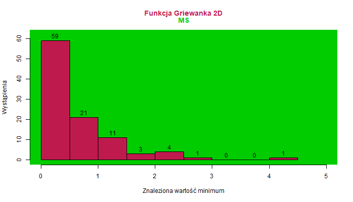
```

```{r, echo=FALSE}
png("G2PRS.png", width = 700, height = 400)
hist(G2PRS, main="", 
     xlab = "Znaleziona wartość minimum", ylab = "Wystąpienia", labels = TRUE,
     ylim = c(0,30), xlim = c(0,2), col=rgb(0.75,0.1,0.3),
     panel.first = rect(par("usr")[1], par("usr")[3], par("usr")[2], par("usr")[4], 
                        col = rgb(1,0,0.83), border = NA)
)
title(main = "Funkcja Griewanka 2D", col.main = rgb(0.75,0.1,0.3), line = 2)
title(main = "PRS", col.main = rgb(1,0,0.83), line = 1)

invisible(dev.off())
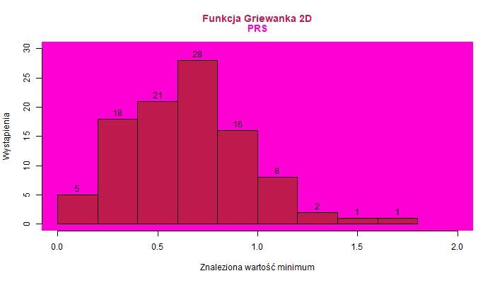
```

```{r,echo=FALSE}
png("G10MS.png", width = 700, height = 400)
hist(G10MS, main="", 
     xlab = "Znaleziona wartość minimum", ylab = "Wystąpienia", labels = TRUE,
     xlim = c(0, 2.5e-10),  
     ylim = c(0, 40), col=rgb(0.75,0.1,0.3),
     panel.first = rect(par("usr")[1], par("usr")[3], par("usr")[2], par("usr")[4], 
                        col = rgb(0,0.8,0), border = NA)
)
title(main = "Funkcja Griewanka 10D", col.main = rgb(0.75,0.1,0.3), line = 2)
title(main = "MS", col.main = rgb(0,0.8,0), line = 1)

invisible(dev.off())
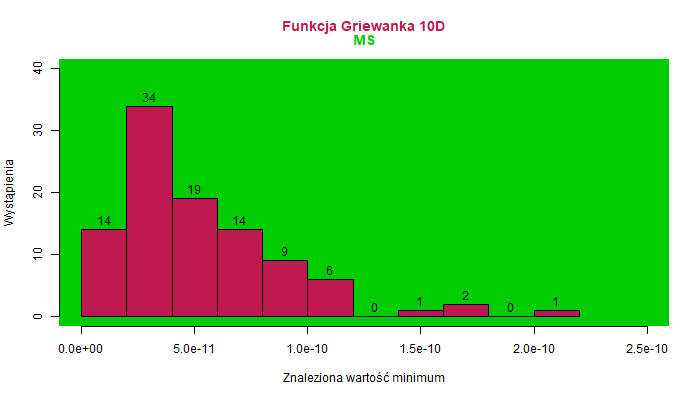
```

```{r echo=FALSE}
png("G10PRS.png", width = 700, height = 400)
hist(G10PRS, main="", 
     xlab = "Znaleziona wartość minimum", ylab = "Wystąpienia", labels = TRUE,
     xlim = c(10, 100), 
     ylim = c(0, 31),col=rgb(0.75,0.1,0.3),
     panel.first = rect(par("usr")[1], par("usr")[3], par("usr")[2], par("usr")[4], 
                        col = rgb(1,0,0.83), border = NA)
     )
title(main = "Funkcja Griewanka 10D", col.main = rgb(0.75,0.1,0.3), line = 2)
title(main = "PRS", col.main = rgb(1,0,0.83), line = 1)

invisible(dev.off())
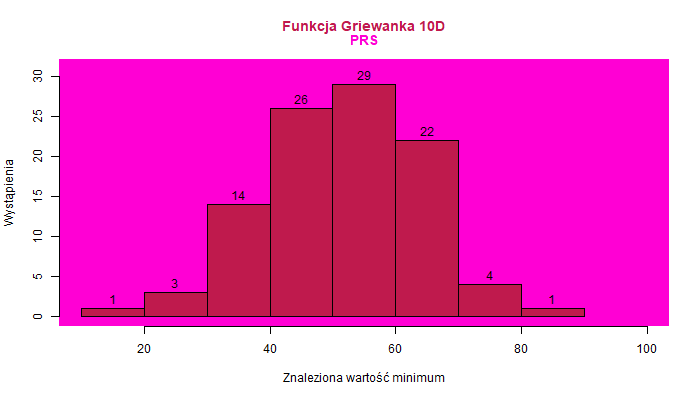
```

```{r,echo=FALSE}
png("G20MS.png", width = 700, height = 400)
hist(G20MS, main="", 
     xlab = "Znaleziona wartość minimum", ylab = "Wystąpienia", labels = TRUE,
     xlim = c(0, 2e-10),  
     ylim = c(0, 26),col=rgb(0.75,0.1,0.3),
     panel.first = rect(par("usr")[1], par("usr")[3], par("usr")[2], par("usr")[4], 
                        col = rgb(0,0.8,0), border = NA)
     )
title(main = "Funkcja Griewanka 20D", col.main = rgb(0.75,0.1,0.3), line = 2)
title(main = "MS", col.main = rgb(0,0.8,0), line = 1)

invisible(dev.off())
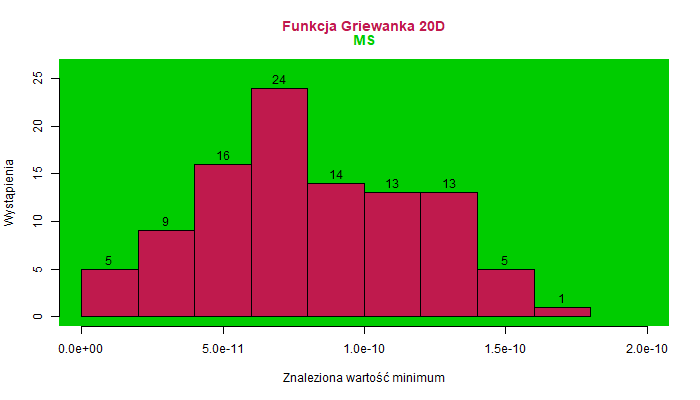
```


```{r echo=FALSE}
png("G20PRS.png", width = 700, height = 400)
hist(G20PRS, main="", 
     xlab = "Znaleziona wartość minimum", ylab = "Wystąpienia", labels = TRUE,
     xlim = c(100, 300),  
     ylim = c(0, 36),col=rgb(0.75,0.1,0.3),
     panel.first = rect(par("usr")[1], par("usr")[3], par("usr")[2], par("usr")[4], 
                        col = rgb(1,0,0.83), border = NA)
     )
title(main = "Funkcja Griewanka 20D", col.main = rgb(0.75,0.1,0.3), line = 2)
title(main = "PRS", col.main = rgb(1,0,0.83), line = 1)

invisible(dev.off())
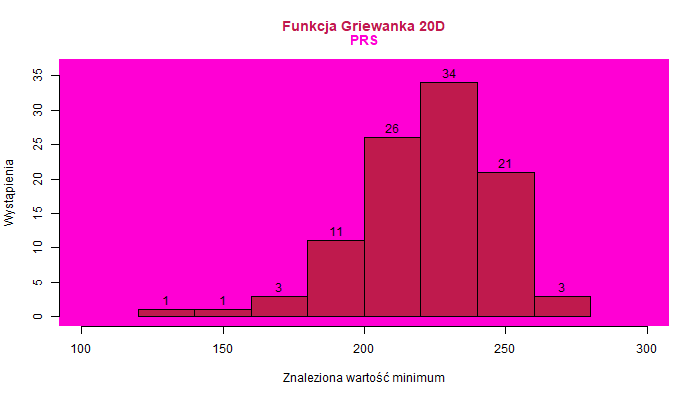
```

```{r,echo=FALSE}
png("S2MS.png", width = 700, height = 400)
hist(S2MS, main="", 
     xlab = "Znaleziona wartość minimum", ylab = "Wystąpienia", labels = TRUE,
     xlim = c(-840,-700), ylim = c(0,103),col="blue",
     panel.first = rect(par("usr")[1], par("usr")[3], par("usr")[2], par("usr")[4], 
                        col = rgb(0,0.8,0), border = NA)
     
     )
title(main = "Funkcja Schwefela 2D", col.main = "blue", line = 2)
title(main = "MS", col.main = rgb(0,0.8,0), line = 1)

invisible(dev.off())
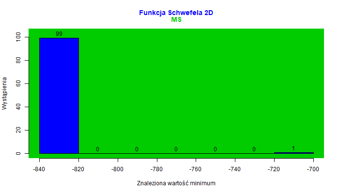
```

```{r echo=FALSE}
png("S2PRS.png", width = 700, height = 400)
hist(S2PRS, main="", 
     xlab = "Znaleziona wartość minimum", ylab = "Wystąpienia", labels = TRUE,
     ylim = c(0,35), xlim = c(-850,-600),col="blue",
     panel.first = rect(par("usr")[1], par("usr")[3], par("usr")[2], par("usr")[4], 
                        col = rgb(1,0,0.83), border = NA)
     )
title(main = "Funkcja Schwefela 2D", col.main = "blue", line = 2)
title(main = "PRS", col.main = rgb(1,0,0.83), line = 1)

invisible(dev.off())
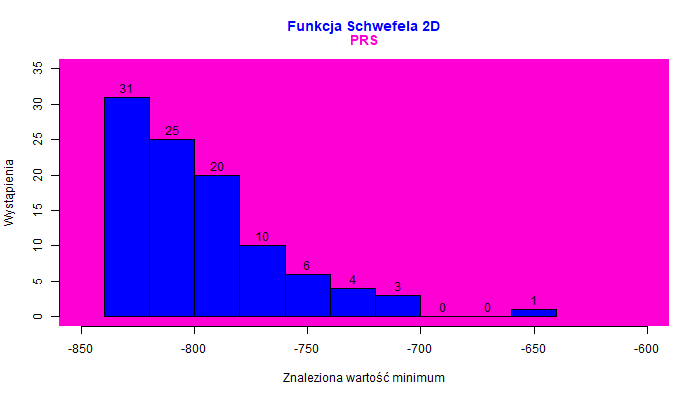
```

```{r,echo=FALSE}
png("S10MS.png", width = 700, height = 400)
hist(S10MS, main="", 
     xlab = "Znaleziona wartość minimum", ylab = "Wystąpienia", labels = TRUE,
     ylim = c(0,26), xlim = c(-3800,-2800),col="blue",
     panel.first = rect(par("usr")[1], par("usr")[3], par("usr")[2], par("usr")[4], 
                        col = rgb(0,0.8,0), border = NA)
     )
title(main = "Funkcja Schwefela 10D", col.main = "blue", line = 2)
title(main = "MS", col.main = rgb(0,0.8,0), line = 1)

invisible(dev.off())
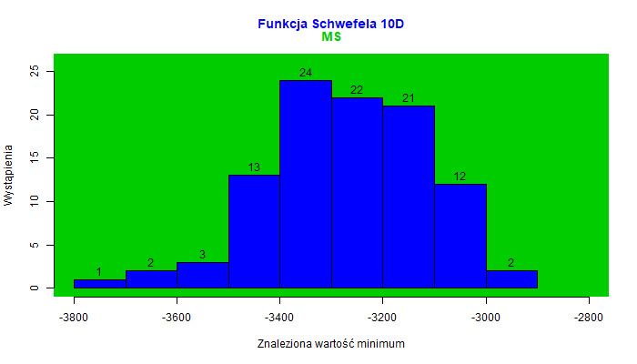
```

```{r echo=FALSE}
png("S10PRS.png", width = 700, height = 400)
hist(S10PRS, main="", 
     xlab = "Znaleziona wartość minimum", ylab = "Wystąpienia", labels = TRUE,
     xlim = c(-2800,-1600), ylim = c(0,28),col="blue",
     panel.first = rect(par("usr")[1], par("usr")[3], par("usr")[2], par("usr")[4], 
                        col = rgb(1,0,0.83), border = NA)
     )
title(main = "Funkcja Schwefela 10D", col.main = "blue", line = 2)
title(main = "PRS", col.main = rgb(1,0,0.83), line = 1)

invisible(dev.off())
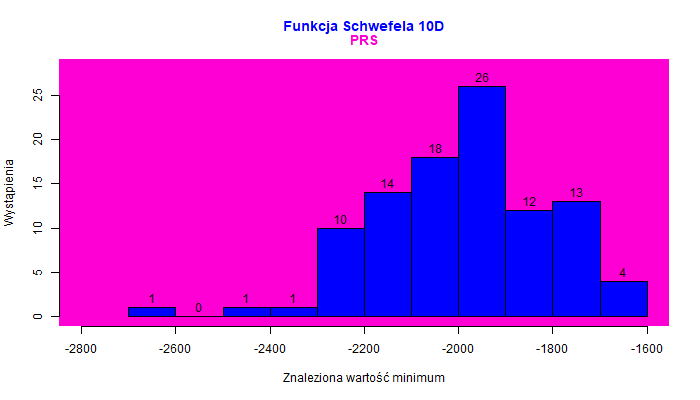
```

```{r,echo=FALSE}
png("S20MS.png", width = 700, height = 400)
hist(S20MS, main="", 
     xlab = "Znaleziona wartość minimum", ylab = "Wystąpienia", labels = TRUE,
     xlim = c(-6800,-5400),ylim = c(0,31),col="blue",
     panel.first = rect(par("usr")[1], par("usr")[3], par("usr")[2], par("usr")[4], 
                        col = rgb(0,0.8,0), border = NA)
     )
title(main = "Funkcja Schwefela 20D", col.main = "blue", line = 2)
title(main = "MS", col.main = rgb(0,0.8,0), line = 1)

invisible(dev.off())
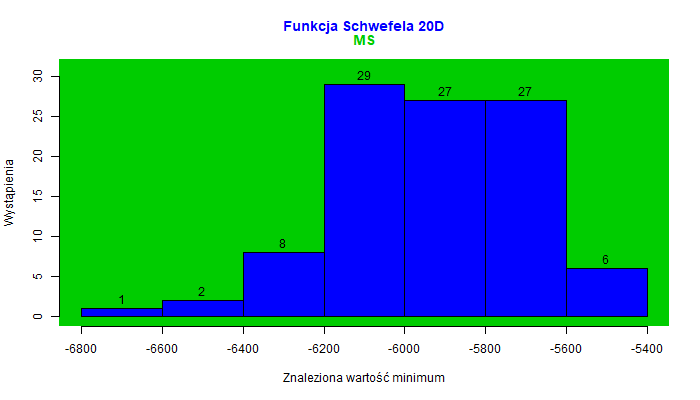
```

```{r echo=FALSE}
png("S20PRS.png", width = 700, height = 400)
hist(S20PRS, main="", 
     xlab = "Znaleziona wartość minimum", ylab = "Wystąpienia", labels = TRUE,
     xlim = c(-4000,-2200), ylim = c(0,35),col="blue",
     panel.first = rect(par("usr")[1], par("usr")[3], par("usr")[2], par("usr")[4], 
                        col = rgb(1,0,0.83), border = NA)
     )
title(main = "Funkcja Schwefela 20D", col.main = "blue", line = 2)
title(main = "PRS", col.main = rgb(1,0,0.83), line = 1)

invisible(dev.off())
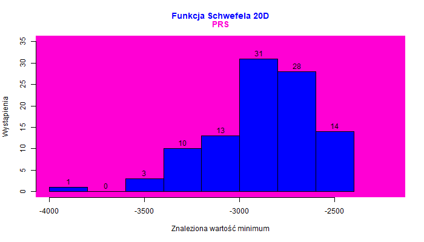
```

# Wykresy pudełkowe

```{r echo=FALSE}
bplot <- boxplot(G2MS, G2PRS, 
                main = "Funkcja Griewanka, 2D",
                col.main = rgb(0.75,0.1,0.3), 
                names = FALSE,  
                ylab = "Wartość",
                col = rgb(1,0,0.5))
axis(1, at = 1:2, 
     labels = FALSE) 
text(1:2, par("usr")[3] - 0.4, 
     labels = c("MS", "PRS"), 
     col = c(rgb(0,0.8,0), rgb(1,0,0.83)), 
     xpd = TRUE)
```
\newpage
```{r,echo=FALSE}
bplot <- boxplot(G10MS, G10PRS, 
                main = "Funkcja Griewanka, 10D",
                col.main = rgb(0.75,0.1,0.3), 
                names = FALSE,  
                ylab = "Wartość",
                col = rgb(1,0,0.5))
axis(1, at = 1:2,
     labels = FALSE) 
text(1:2, 
     labels = c("MS", "PRS"),  par("usr")[3] - 8, 
     col = c(rgb(0,0.8,0), rgb(1,0,0.83)), 
     xpd = TRUE)
```
\newpage
```{r,echo=FALSE}
bplot <- boxplot(G20MS, G20PRS, 
                main = "Funkcja Griewanka, 20D",
                col.main = rgb(0.75,0.1,0.3), 
                names = FALSE,  
                ylab = "Wartość",
                col = rgb(1,0,0.5))
axis(1, at = 1:2, 
     labels = FALSE) 
text(1:2, par("usr")[3] - 23.5, 
     labels = c("MS", "PRS"), 
     col = c(rgb(0,0.8,0), rgb(1,0,0.83)), 
     xpd = TRUE)
```
\newpage
```{r,echo=FALSE}
bplot <- boxplot(S2MS,S2PRS, 
                main = "Funkcja Schwefela, 2D",
                col.main = "blue", 
                names = FALSE,  
                ylab = "Wartość",
                col = rgb(0,0,1))
axis(1, at = 1:2, 
     labels = FALSE) 
text(1:2, par("usr")[3] - 18.5, 
     labels = c("MS", "PRS"), 
     col = c(rgb(0,0.8,0), rgb(1,0,0.83)), 
     xpd = TRUE)
```
\newpage
```{r,echo=FALSE}
bplot <- boxplot(S10MS,S10PRS, 
                main = "Funkcja Schwefela, 10D",
                col.main = "blue", 
                names = FALSE,  
                ylab = "Wartość",
                col = rgb(0,0,1))
axis(1, at = 1:2, 
     labels = FALSE) 
text(1:2, par("usr")[3] - 155.5, 
     labels = c("MS", "PRS"), 
     col = c(rgb(0,0.8,0), rgb(1,0,0.83)), 
     xpd = TRUE)
```
\newpage
```{r,echo=FALSE}
bplot <- boxplot(S20MS,S20PRS, 
                main = "Funkcja Schwefela, 20D",
                col.main = "blue", 
                names = FALSE,  
                ylab = "Wartość",
                col = rgb(0,0,1))
axis(1, at = 1:2, 
     labels = FALSE) 
text(1:2, par("usr")[3] - 335.5, 
     labels = c("MS", "PRS"), 
     col = c(rgb(0,0.8,0), rgb(1,0,0.83)), 
     xpd = TRUE)
```

\newpage

## T testy

Dla hipotezy zerowej twierdzącej, że średnie są sobie równe

#### Funkcja Griewanka, 2D

```{r echo=FALSE}
t.test(x = G2PRS, y = G2MS, paired = TRUE)
```

#### Funkcja Griewanka, 10D

```{r echo=FALSE}
t.test(x = G10PRS, y = G10MS, paired = TRUE)
```

#### Funkcja Griewanka, 20D

```{r echo=FALSE}
t.test(x = G20PRS, y = G20MS, paired = TRUE)
```

\newpage

#### Funkcja Schwefela, 2D

```{r echo=FALSE}
t.test(x = S2PRS, y = S2MS, paired = TRUE)
```

#### Funkcja Schwefela, 10D

```{r echo=FALSE}
t.test(x = S10PRS, y = S10MS, paired = TRUE)
```

#### Funkcja Schwefela, 20D

```{r echo=FALSE}
t.test(x = S20PRS, y = S20MS, paired = TRUE)
```

\newpage

## Wnioski podsumowujące:

Funkcja Schwefela wykazuje większe różnice między algorytmami niż funkcja Griewanka. Dla funkcji Griewanka w 2D nie zaobserwowano istotnej różnicy między algorytmami, ale
dla wyższych wymiarów (10D, 20D) MS osiąga znacząco lepsze wyniki niż PRS.
W przypadku funkcji Schwefela, która charakteryzuje się trudnymi krajobrazami z wieloma lokalnymi minimami, metoda MS znacznie lepiej radzi sobie z eksplorowaniem przestrzeni poszukiwań i znajdowaniem głębszych minimów. Z kolei PRS wykazuje pewne trudności w bardziej złożonych przestrzeniach, co prowadzi do większych różnic w wynikach w wymiarach wyższych niż 2D.

W funkcji Schwefela dla 10D i 20D różnice między algorytmami stają się wyraźniejsze, ponieważ w tych wymiarach przestrzeń staje się bardziej złożona. Różnice w wynikach są statystycznie istotne, co wskazuje na większą efektywność MS w radzeniu sobie z trudnymi funkcjami optymalizacyjnymi w wyższych wymiarach. Wraz ze wzrostem liczby wymiarów, różnica między algorytmami staje się coraz bardziej wyraźna. PrzewagaMS nad PRS rośnie wykładniczo wraz z wymiarowością.
Testy statystyczne (t-test) oraz średnie różnice wskazują, że algorytmy różnią się w sposobie rozwiązywania problemu.